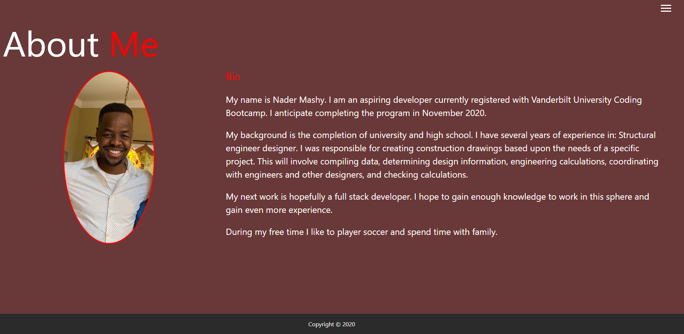
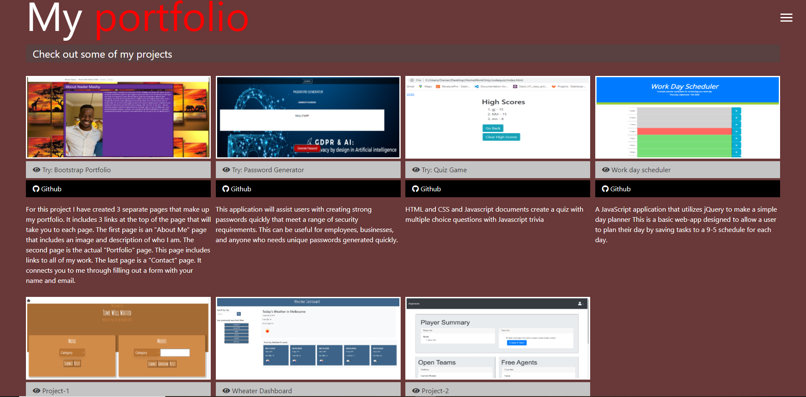

## Update portfolio

Updated site have the following content:

My name

Links to my GitHub profile & LinkedIn page as well as my email address and phone number

A link to a PDF of my resume

A list of projects. For each project :

Project title

Link to the deployed version

Link to the GitHub repository

Screenshot of the deployed application..

## Link :

https://github.com/NadoraLuka/Portfolio
https://nadoraluka.github.io/Portfolio/

## Screenshot

.
.